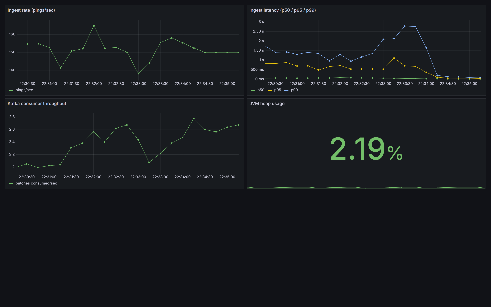
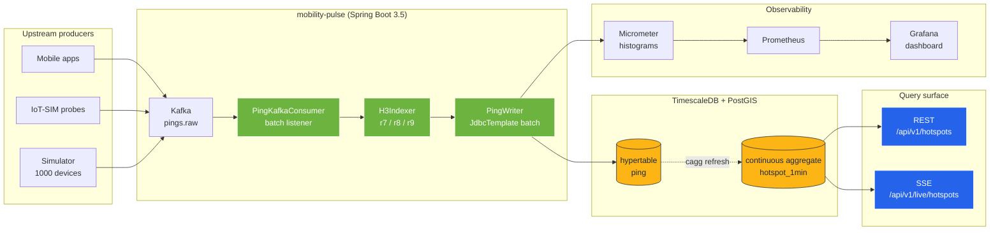
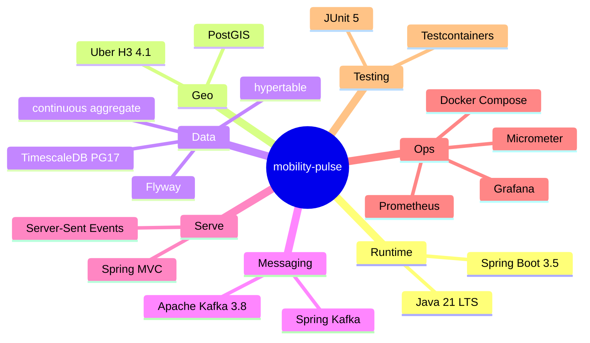
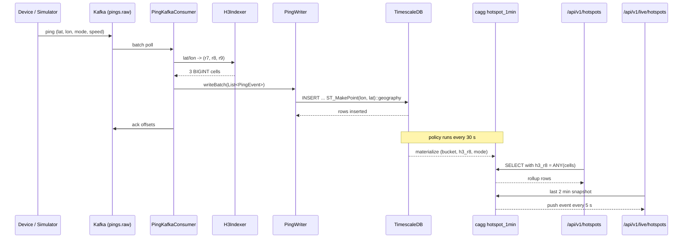

# mobility-pulse

> Real-time urban mobility analytics — ingest device pings, index them with **Uber H3** hexagons, store them in a **TimescaleDB + PostGIS** hypertable, and expose live city hotspots via REST and Server-Sent Events.

[](https://openjdk.org/projects/jdk/21/)
[](https://spring.io/projects/spring-boot)
[](https://www.timescale.com/)
[](https://postgis.net/)
[](https://h3geo.org/)
[](https://kafka.apache.org/)
[](https://grafana.com/)
[](https://www.docker.com/)
[](LICENSE)
[](#status)

---

## Why this exists

Every city running connected mobility — bike-share, scooter fleets, MaaS apps, smart-city probes, IoT-SIM connected cars — faces the same back-end problem: **millions of geo-tagged events per hour that have to be written durably, rolled up in real time, and served as heatmaps without melting the database.**

`mobility-pulse` is a focused simulation of that pipeline — end-to-end, not toy-ware — built around three design choices that would take a senior engineer more than a weekend to get right:

1. **Time-series storage, not "a table with more rows"** — a TimescaleDB hypertable with compression + retention policies.
2. **Spatial indexing via Uber H3 hexagons, not raw lat/lon range scans** — O(1) cell lookup at write time, B-tree reads on a single `BIGINT` at query time.
3. **Live-blended continuous aggregates** — `materialized_only = false` so reads return sub-minute freshness without waiting for a refresh.



## At a glance



## Features

### Ingest

- **Kafka batch consumer** with `ErrorHandlingDeserializer` so a poison pill never kills the group
- Manual offset acknowledgement — offsets only advance after a successful DB write
- **Batch `INSERT`s via JdbcTemplate** — bypasses JPA dirty-tracking overhead on the write-heavy hot path
- **Write-time H3 indexing** at three resolutions (r7 / r8 / r9) so queries can hit a plain btree

### Storage

- TimescaleDB **hypertable** partitioned on `ts` in 1-hour chunks
- **Compression** policy with `segmentby = h3_r8` — per-hex queries stay fast even on compressed chunks
- **Retention** policy keeps raw pings for 7 days; aggregates live longer
- **PostGIS** `geography(POINT, 4326)` column for true spherical-distance queries (no Mercator drift)
- **Continuous aggregate** `hotspot_1min` materialized on `(h3_r8, mode)` buckets — refreshed every 30 s

### Query

- `GET /api/v1/hotspots?from&to&south&west&north&east&mode&limit` — windowed rollup
- **Bounding-box → H3 cell set** via `polygonToCells` pushed into SQL as `BIGINT[]` → cheap index scan, no spatial distance filter on the cagg
- `GET /api/v1/live/hotspots` — **Server-Sent Events** stream, 5 s push, 15 s heartbeat, per-subscriber bbox + mode filter
- Live-blended reads: recent sub-minute data is returned straight from the hypertable without waiting for cagg refresh

### Simulator

- `mobility.simulator.enabled=true` spawns 1000 synthetic devices inside the Paris bounding box
- 6 transport modes (PEDESTRIAN / BIKE / SCOOTER / CAR / BUS / TRAM) with realistic base speeds
- Random-walk movement with heading jitter and bbox wrap-around
- Publishes to the same Kafka topic the real consumer reads — end-to-end demo in one `docker compose up`

### Observability

- Micrometer metrics under `mobility.ingest.*`
- **Percentile histograms** configured for `mobility.ingest.latency` with explicit SLO buckets at 10 ms / 50 ms / 100 ms / 500 ms / 1 s
- Prometheus + pre-provisioned Grafana dashboard (ingest rate, p50/p95/p99 latency, Kafka throughput, JVM heap)

## Tech stack



## Event lifecycle



## Getting started

### Prerequisites

- Java 21 (Temurin recommended)
- Docker 24+
- Maven Wrapper is bundled — no global Maven needed

### Run locally

```bash
git clone https://github.com/soneeee22000/mobility-pulse.git
cd mobility-pulse

# Bring up TimescaleDB (PG17 + PostGIS), Kafka, Prometheus, Grafana
docker compose up -d

# Run the app (8080) — migrations run automatically on boot
./mvnw spring-boot:run

# OR, in a separate shell, run with the simulator switched on
./mvnw spring-boot:run -Dspring-boot.run.arguments=--mobility.simulator.enabled=true
```

Open:

- API: `http://localhost:8080/actuator/health`
- Prometheus: `http://localhost:9090`
- Grafana: `http://localhost:3000` (`admin` / `admin`) → Dashboards → _mobility-pulse_ → _Mobility Pulse_

### Publish a single ping

```bash
curl -s -X POST http://localhost:8080/api/v1/pings \
  -H 'Content-Type: application/json' \
  -d '{
    "deviceId": "scooter-42",
    "mode": "SCOOTER",
    "lat": 48.8566,
    "lon": 2.3522,
    "speedKmh": 18.5,
    "headingDeg": 92,
    "ts": "2026-04-24T12:00:00Z"
  }'
```

### Query hotspots

```bash
curl -s "http://localhost:8080/api/v1/hotspots?\
from=2026-04-24T11:00:00Z&to=2026-04-24T13:00:00Z&\
south=48.815&west=2.224&north=48.902&east=2.470&\
mode=SCOOTER&limit=200" | jq '.[0:3]'
```

Sample response:

```json
[
  {
    "bucket": "2026-04-24T12:02:00Z",
    "h3Cell": "881fb46625fffff",
    "mode": "SCOOTER",
    "pingCount": 147,
    "avgSpeedKmh": 19.7
  }
]
```

### Subscribe to live hotspots

```bash
curl -N "http://localhost:8080/api/v1/live/hotspots?\
south=48.815&west=2.224&north=48.902&east=2.470&\
mode=BIKE"
```

Each 5 seconds you'll see a push of the last 2-minute rollup for the bbox:

```
event: ready
data: connected

event: hotspots
data: [{"bucket":"2026-04-24T12:03:00Z","h3Cell":"881fb4...","pingCount":42,...}]
```

## API reference

| Method | Path                    | Purpose                                                |
| ------ | ----------------------- | ------------------------------------------------------ |
| `POST` | `/api/v1/pings`         | Ingest a single ping (validated)                       |
| `POST` | `/api/v1/pings/batch`   | Ingest up to N pings in one call                       |
| `GET`  | `/api/v1/hotspots`      | Rollup query over a time window + optional bbox + mode |
| `GET`  | `/api/v1/live/hotspots` | SSE stream — push every 5 s, heartbeat every 15 s      |
| `GET`  | `/actuator/health`      | Liveness + dependency health                           |
| `GET`  | `/actuator/prometheus`  | Scraped by Prometheus                                  |

## Project structure

```
mobility-pulse/
├── docker-compose.yml              # TimescaleDB, Kafka, Prometheus, Grafana
├── pom.xml                         # Spring Boot 3.5 + H3 + Flyway
├── ops/
│   ├── prometheus.yml
│   └── grafana/
│       ├── dashboards/mobility-pulse.json
│       └── provisioning/
└── src/main/
    ├── java/dev/pseonkyaw/mobilitypulse/
    │   ├── api/                    # REST + SSE controllers, DTOs
    │   ├── config/                 # Kafka + properties wiring
    │   ├── domain/                 # PingEvent, TransportMode
    │   ├── geo/                    # H3Indexer, BboxResolver
    │   ├── ingest/                 # Kafka consumer + batch writer + service
    │   ├── query/                  # cagg repository + hotspot service
    │   └── simulator/              # Paris mobility fleet
    └── resources/
        ├── application.yml
        └── db/migration/V1__init_schema.sql
```

## Design decisions

| Decision                                                        | Why                                                                                                                                                                                                                                                                                 |
| --------------------------------------------------------------- | ----------------------------------------------------------------------------------------------------------------------------------------------------------------------------------------------------------------------------------------------------------------------------------- |
| **TimescaleDB hypertable with 1-hour chunks**                   | Urban mobility traffic is bursty and well-bounded by hour. 1-hour chunks keep per-query chunk scan cost low and let the retention policy drop entire chunks without `DELETE` contention.                                                                                            |
| **H3 at write time, three resolutions**                         | `latLngToCell` is O(1) on known projection math; doing it once at write time lets every query use a plain btree on a single `BIGINT`. Storing r7/r8/r9 costs 24 bytes extra per row and buys us city / neighbourhood / block drill-downs for free.                                  |
| **PostGIS `geography(POINT, 4326)` even though we query on H3** | H3 is great for bucket lookups but not for "within radius" queries. Keeping the geography column lets us answer "pings within 300m of a metro entrance" without reprojecting. Cost: one GIST index.                                                                                 |
| **`materialized_only = false` on the cagg**                     | Without this, a query on `hotspot_1min` would miss the last 30 s until the refresh policy runs. With it, TimescaleDB blends real-time hypertable data with the materialized rollup transparently — so live SSE push is actually live.                                               |
| **`compress_segmentby = h3_r8`**                                | Compressed chunks are stored as columnar batches per `segmentby` value, so a filter on `h3_r8 = ANY(...)` stays fast after compression. Picking the wrong segmentby turns a compressed read into a full table scan.                                                                 |
| **JdbcTemplate batch insert, not JPA**                          | The hot path writes 200+ rows/sec. JPA's dirty-tracking and cascade bookkeeping are wasted work here; `BatchPreparedStatementSetter` with `rewriteBatchedStatements=true` gives us an order-of-magnitude higher throughput. JPA is still fine for control-plane tables added later. |
| **`ErrorHandlingDeserializer` + manual ack**                    | A malformed JSON message should not stop the consumer group. Manual ack means offsets only advance after the DB write succeeds — so a DB outage rewinds cleanly on restart.                                                                                                         |
| **Bbox → H3 cell set, not spatial `ST_Covers`**                 | Running `ST_Covers(geo, bbox)` on the cagg would force a join back to the hypertable. Precomputing the covering cells in Java and passing them as `BIGINT[]` lets the cagg query stay in its own index and finish in single-digit ms.                                               |
| **Server-Sent Events, not WebSocket**                           | One-way push is all we need. SSE is HTTP, works through every proxy, needs no framing layer, and re-uses Spring MVC's thread pool without a reactive stack.                                                                                                                         |

## Status

Portfolio project — not production. TLS, authentication, rate-limiting per tenant, and multi-region replication are explicitly out of scope. Built to demonstrate:

- **TimescaleDB** operational knowledge (hypertables, compression, retention, continuous aggregates with `materialized_only=false`)
- **PostGIS** + **Uber H3** hybrid indexing strategy
- **Kafka** consumer hardening and batch-write throughput patterns
- **Server-Sent Events** with proper heartbeat and subscriber lifecycle
- **Micrometer / Prometheus / Grafana** observability with histogram tuning

## License

MIT — see [LICENSE](LICENSE).

## Author

**Pyae Sone (Seon)** — [@soneeee22000](https://github.com/soneeee22000) · [linkedin.com/in/pyae-sone-kyaw](https://linkedin.com/in/pyae-sone-kyaw) · [pseonkyaw.dev](https://pseonkyaw.dev)

Paris-based back-end engineer with production experience in smart-city mobility analytics (Floware), building JVM-first back-ends for real-time, geo-aware workloads. Dual Master's from Telecom SudParis / Institut Polytechnique de Paris.
